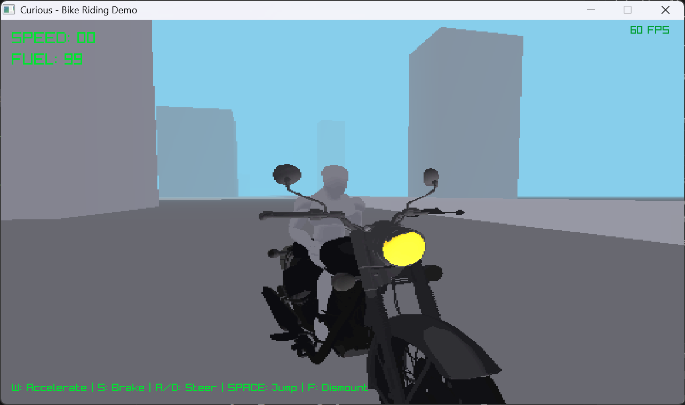

# RayRider



A high-speed, daylight motorcycle riding experience built from scratch in C++ using Raylib.

## Features
- **Custom Physics**: Built-in motorcycle physics featuring acceleration, braking, realistic turning logic with leans, and gravity/jumping.
- **Architectural Generation**: Procedural generation of simple concrete structures and highways along the riding path.
- **Player Controller**: Mount and dismount the bike seamlessly. Walk, sprint, jump, or crouch while exploring on foot.
- **Custom Render Pipeline**: Features a custom daylight rendering pipeline with directional sunlight, ambient lighting, atmospheric depth fog, and a high-resolution shadow map.
- **Low-Res Aesthetic Filter**: A stylistic 480x360 internal rendering target upscaled to match the active window resolution.

## Controls
### On Foot
- **W, A, S, D**: Move
- **Left Shift**: Sprint
- **Left Ctrl**: Crouch / Sneak
- **Space**: Jump
- **Mouse**: Look around
- **V**: Toggle First-Person / Third-Person camera
- **F**: Mount Motorcycle (when close)

### On Motorcycle
- **W**: Accelerate
- **S**: Brake / Reverse
- **A / D**: Steer left and right
- **Space**: Jump
- **F**: Dismount
- **V**: Toggle First-Person / Third-Person camera

## Build Instructions (Windows)
Ensure you have MinGW `g++` installed and added to your system PATH.

1. Clone the repository.
2. Ensure you have the Raylib 5.0 binaries in the `include` and `lib` folders.
3. Run the included build script:
   ```cmd
   .\build.bat
   ```
4. Run the compiled executable:
   ```cmd
   .\RayRider.exe
   ```
